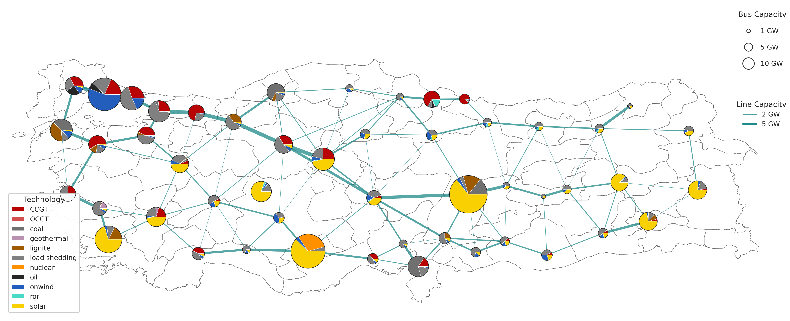

## PyPSA-TR: An open-source energy system model of Turkey's electricity network
PyPSA-TR is built on the PyPSA-Earth framework, It provides high-resolution analysis and optimization of electricity generation, transmission, storage, and renewable energy integration. The model derives Turkiye's renewable energy potential and future power system under different scenarios using publicly available data. This repository provides reproducible framework to support power system planning, decarbonization studies, and long-term energy strategy analysis.

  ## PyPSA-TR Network 



## commands for running PyPSA-TR


### Full workflow

Run the complete workflow:

```bash
snakemake solve_all_networks --configfile configs/turkey_100.yaml --cores 8
```

### Partial workflow

#### Build the clustered network

```bash
snakemake cluster_network --configfile configs/turkey_100.yaml --cores 8
```

#### Prepare the network

```bash
snakemake prepare_network --configfile configs/turkey_100.yaml --cores 8
```

#### Solve the optimization model

```bash
snakemake solve_network --configfile configs/turkey_100.yaml --cores 8
```


## Notes

- Adjust the number of `--cores` according to your available CPU resources.
- Use the `-n` (dry-run) option to verify the workflow before execution:

```bash
snakemake solve_all_networks \
    --configfile configs/turkey_100.yaml \
    --cores 8 \
    -n
```

## License

PyPSA-TR is based on **PyPSA-Earth**, which is released under the **MIT License**. Input datasets used in this project may be subject to their own licenses and terms of use. Please refer to the original PyPSA-Earth documentation and the respective data providers for details.
